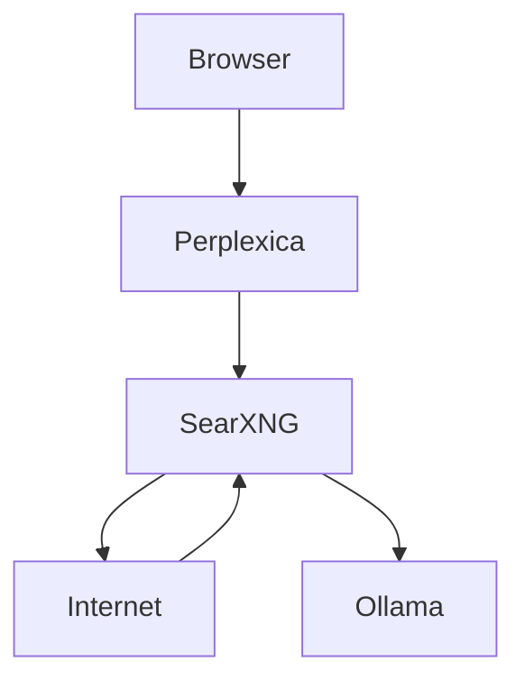
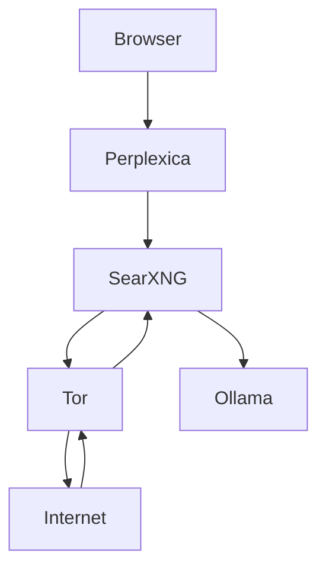

# 🚀 AI Search Stack

Private, local-first AI search with optional anonymous routing.


---

## ✨ Overview

This repository provides a production-minded AI search stack built on:

- 🧠 **Ollama** — local LLM inference
- 🔍 **SearXNG** — privacy-respecting meta-search
- ⚡ **Redis** — backend for rate limiting and request tracking  
- 💬 **Perplexica** — AI-powered search interface
- 🧅 **Tor (optional)** — anonymous outbound traffic

The goal is to provide a self-hosted, privacy-first alternative to hosted AI search products while keeping the deployment simple enough for a local workstation.

---

## 🏗 Architecture

### Standard mode


### Privacy mode (Tor enabled)


---

## ⚡ Features

- Local AI inference with Ollama
- Semantic search support via embeddings
- SearXNG-based metasearch
- Optional Tor egress for privacy-sensitive queries
- Docker Compose deployment
- Modular repository layout with operational docs

---

## ⚡ Quick Start

### 1. Copy the environment template
```bash
cp .env.example .env
```

### 2. Start the base stack
```bash
docker compose -f compose.yaml up -d
```

### 3. Start the Tor-enabled stack
```bash
docker compose -f compose.yaml -f compose.tor.yaml up -d
```

---

## 🧠 Models

### Generation model
docker exec -it ai-search-ollama ollama pull llama3.1:8b

### Embedding model
docker exec -it ai-search-ollama ollama pull nomic-embed-text

---

## 🔧 Scripts

The repository includes helper scripts for common operational tasks.

---

### ▶️ Start base stack
Windows:
```powershell
./scripts/windows/start-base.ps1
```

Linux:
```bash
./scripts/linux/start-base.sh
```

---

### 🧅 Start with Tor
Windows:
```powershell
./scripts/windows/start-tor.ps1
```

Linux:
```bash
./scripts/linux/start-tor.sh
```

Starts full stack with Tor routing enabled for SearXNG.

---

### 🧠 Pull AI models
Windows:
```powershell
./scripts/windows/pull-models.ps1
```

Linux:
```bash
./scripts/linux/pull-models.sh
```

Downloads required models:
- llama3.1:8b — generation model  
- nomic-embed-text — embedding model  

---

### ♻️ Full Docker reset
Windows:
```powershell
./scripts/windows/reset-docker.ps1
```

Linux:
```bash
./scripts/linux/reset-docker.sh
```

Performs complete cleanup:
- stops containers  
- removes volumes  
- removes networks  
- prunes Docker system  

> ⚠️ This will delete all local data (including downloaded models)

---

## 💡 Notes

- Scripts are optional — you can use docker compose manually  

---

## 🌐 Service Endpoints

Perplexica: http://localhost:3000  
SearXNG: http://localhost:8080  
Ollama: http://localhost:11434  

---

## 🔗 Internal URLs (Docker)

Ollama: http://ollama:11434  
SearXNG: http://searxng:8080  

⚠️ Do NOT use localhost inside containers

---

## 📄 License

MIT
